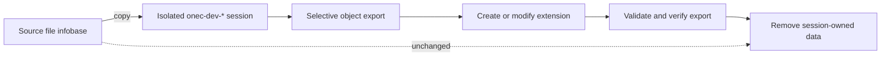

<p align="center">
  
</p>

<h1 align="center">1C:Enterprise Agent Toolkit</h1>

<p align="center">
  Safe Agent Skills for precise 1C:Enterprise configuration and extension development
</p>

<p align="center">
  <a href="README.md">Русский</a> · <strong>English</strong>
</p>

<p align="center">
  <a href="https://github.com/Muredsa/1C-Enterprise-Agent-Toolkit/actions/workflows/ci.yml"></a>
  <a href="https://github.com/Muredsa/1C-Enterprise-Agent-Toolkit/releases/latest"></a>
  <a href="LICENSE"></a>
  
</p>


A universal toolkit for AI agents working with **any 1C:Enterprise application configuration**, BSL, and configuration extensions. It is not tied to UNF or another standard configuration: it exports only user-selected metadata, isolates extension work from the source infobase, validates Designer batch results, and removes session-owned temporary data after the task.

## Install in 60 seconds

```powershell
git clone https://github.com/Muredsa/1C-Enterprise-Agent-Toolkit.git
cd 1C-Enterprise-Agent-Toolkit
py install.py --agent codex
```

Restart Codex and invoke `$onec-dev`. For Claude Code, use `python3 install.py --agent claude`; for another agent, use `python3 install.py --target /path/to/agent/skills`.

> [!IMPORTANT]
> The 1C platform and infobase are not bundled. Test the first run on a disposable copy.

## Included skills

| Skill | Purpose |
| --- | --- |
| `onec-dev` | Selects a safe workflow and controls mutation boundaries |
| `onec-selective-export` | Exports only required objects through `/DumpConfigToFiles -listFile` |
| `onec-extension-lifecycle` | Creates, dumps, loads, backs up, rolls back, and deletes one extension |
| `onec-extension-validate` | Checks BSL, configuration integrity, applicability, database update, and final `.cfe` |

The shared `scripts/onec.py` CLI uses only the Python standard library. The `skills/<name>/SKILL.md` layout is portable across agents.

## Safe lifecycle



Core guarantees:

- a file infobase is copied into a marked disposable session by default;
- all logs, `/DumpResult` files, exports, and backups remain inside that session;
- cleanup rejects drive roots, home/current directories, invalid markers, and links;
- passwords are read only through a named environment variable;
- an existing extension is backed up in editable and database formats;
- success requires a zero process code, zero `/DumpResult`, and no error diagnostics in the log.

Read the complete [safety contract](skills/onec-dev/references/safety-contract.md).

<p align="center">
  
</p>

## First safe run

Discover the platform:

```powershell
py scripts/onec.py discover
```

Create an isolated session:

```powershell
py scripts/onec.py session-create `
  --base-file "C:\path\to\base" `
  --user "Administrator"
```

Use the `session` path returned in JSON:

```powershell
py scripts/onec.py selective-export `
  --session "C:\path\to\onec-dev-...\manifest.json" `
  --object "Catalog.Products"
```

Clean up when finished:

```powershell
py scripts/onec.py session-cleanup `
  --session "C:\path\to\onec-dev-...\manifest.json"
```

See the complete universal [`examples/safe-object-inspection`](examples/safe-object-inspection/README.en.md) workflow. Run `py scripts/onec.py <command> --help` for every option.

A live file infobase requires both `--no-sandbox --allow-live-base`; a server or connection-string target requires `--allow-live-base`. Use these modes only after an explicit user decision.

## Compatibility

| Environment | Integration | Status |
| --- | --- | --- |
| Codex | `install.py --agent codex` and `.codex-plugin/plugin.json` | Supported |
| Claude Code | `install.py --agent claude` and `.claude-plugin/plugin.json` | Supported |
| Other Agent Skills clients | `install.py --target …` | Portable installation |
| 1C:Enterprise | Designer batch mode | Tested with `8.5.1.1343` |
| Configurations | Any application configuration | No hard-coded objects; integration-tested with UNF |

Selective export requires a platform version that supports `-listFile`. Object names are always supplied explicitly, so the CLI works the same way with standard, industry-specific, and custom configurations. When scaffolding an extension, it detects the configuration's default language instead of assuming Russian. UNF is only the documented integration-test environment, not a toolkit limitation.

## Validate the project

```bash
python3 -m unittest discover -s tests -v
```

CI checks the Python code, manifests, skill frontmatter, and cleanup boundaries. The local integration procedure is in [tests/INTEGRATION.md](tests/INTEGRATION.md); the completed UNF run is recorded in [tests/INTEGRATION-2026-08-11.md](tests/INTEGRATION-2026-08-11.md).

## Roadmap

- more verified examples for common configurations;
- stable releases with compatibility notes;
- broader automated checks without weakening the safety contract;
- agent-directory packages after the formats stabilize.

## Contributing

Report bugs and ideas through [Issues](https://github.com/Muredsa/1C-Enterprise-Agent-Toolkit/issues). Read [CONTRIBUTING.md](CONTRIBUTING.md) and [SECURITY.md](SECURITY.md) before opening a Pull Request.

Released under the [MIT License](LICENSE). 1C and 1C:Enterprise are trademarks of their respective owner. This independent community project is not affiliated with or endorsed by 1C Company.
