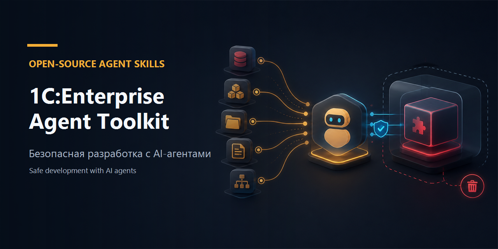
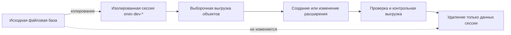
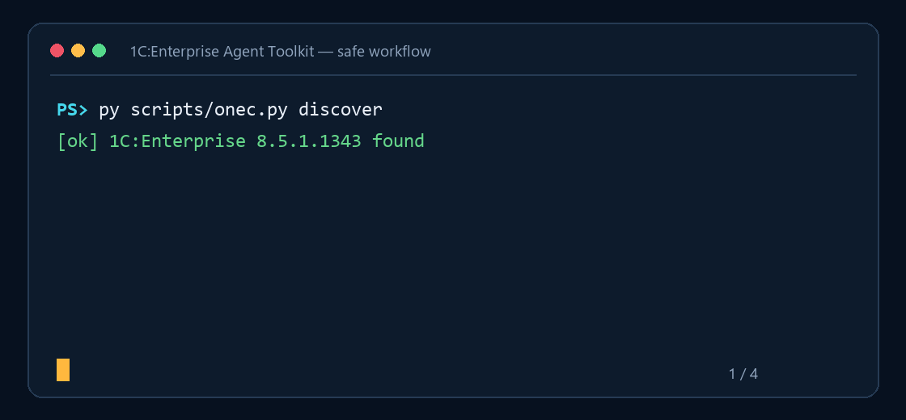

<p align="center">
  
</p>

<h1 align="center">1C:Enterprise Agent Toolkit</h1>

<p align="center">
  Безопасные Agent Skills для точной разработки конфигураций и расширений 1С
</p>

<p align="center">
  <strong>Русский</strong> · <a href="README.en.md">English</a>
</p>

<p align="center">
  <a href="https://github.com/Muredsa/1C-Enterprise-Agent-Toolkit/actions/workflows/ci.yml"></a>
  <a href="https://github.com/Muredsa/1C-Enterprise-Agent-Toolkit/releases/latest"></a>
  <a href="LICENSE"></a>
  
</p>



Инструментарий для AI-агентов, которые работают с **1С:Предприятие**, BSL, конфигурациями, расширениями и УНФ. Он выгружает только явно нужные метаданные, изолирует работу над расширениями от основной базы, проверяет результат пакетного Конфигуратора и удаляет созданные им временные данные.

## Установка за 60 секунд

```powershell
git clone https://github.com/Muredsa/1C-Enterprise-Agent-Toolkit.git
cd 1C-Enterprise-Agent-Toolkit
py install.py --agent codex
```

Перезапустите Codex и вызовите `$onec-dev`. Для Claude Code используйте `python3 install.py --agent claude`, а для другого агента — `python3 install.py --target /path/to/agent/skills`.

> [!IMPORTANT]
> Платформа 1С и информационная база не входят в проект. Перед первым использованием проверьте работу на одноразовой копии базы.

## Что умеет

| Скилл | Назначение |
| --- | --- |
| `onec-dev` | Выбирает безопасный рабочий процесс и контролирует границы изменений |
| `onec-selective-export` | Выгружает только требуемые объекты через `/DumpConfigToFiles -listFile` |
| `onec-extension-lifecycle` | Создаёт, выгружает, загружает, резервирует, откатывает и удаляет одно расширение |
| `onec-extension-validate` | Проверяет BSL, конфигурацию, применимость, обновление БД и итоговый `.cfe` |

Общий CLI `scripts/onec.py` использует только стандартную библиотеку Python. Структура `skills/<name>/SKILL.md` переносима между агентами.

## Как устроен безопасный цикл



Основные гарантии:

- файловая база по умолчанию копируется в отдельную маркированную сессию;
- все логи, `/DumpResult`, выгрузки и резервные копии остаются внутри неё;
- очистка отклоняет корень диска, домашнюю и текущую папку, неверный маркер и ссылки;
- пароль передаётся только через имя переменной окружения;
- существующее расширение резервируется в редактируемом и рабочем формате;
- успешным считается только нулевой код процесса, нулевой `/DumpResult` и чистый лог.

Полные ограничения описаны в [контракте безопасности](skills/onec-dev/references/safety-contract.md).

<p align="center">
  
</p>

## Первый безопасный запуск

Найдите установленную платформу:

```powershell
py scripts/onec.py discover
```

Создайте изолированную сессию:

```powershell
py scripts/onec.py session-create `
  --base-file "C:\путь\к\базе" `
  --user "Администратор"
```

Используйте путь `session` из полученного JSON:

```powershell
py scripts/onec.py selective-export `
  --session "C:\путь\к\onec-dev-...\manifest.json" `
  --object "Catalog.Номенклатура"
```

После работы удалите сессию:

```powershell
py scripts/onec.py session-cleanup `
  --session "C:\путь\к\onec-dev-...\manifest.json"
```

Готовый сценарий находится в [`examples/safe-unf-inspection`](examples/safe-unf-inspection/README.md). Все параметры доступны через `py scripts/onec.py <команда> --help`.

Живая файловая база требует одновременно `--no-sandbox --allow-live-base`; серверная или заданная строкой подключения — `--allow-live-base`. Эти режимы применяются только после явного решения пользователя.

## Совместимость

| Среда | Способ подключения | Статус |
| --- | --- | --- |
| Codex | `install.py --agent codex` и `.codex-plugin/plugin.json` | Поддерживается |
| Claude Code | `install.py --agent claude` и `.claude-plugin/plugin.json` | Поддерживается |
| Другие Agent Skills-клиенты | `install.py --target …` | Переносимая установка |
| 1С:Предприятие | Пакетный режим Конфигуратора | Проверено на `8.5.1.1343` |
| Конфигурации | УНФ и другие конфигурации | УНФ проверена; остальные сначала тестируйте на копии |

Выборочная выгрузка требует платформу с поддержкой `-listFile`. При создании расширения CLI сам определяет основной язык конфигурации и не предполагает, что это русский.

## Проверка проекта

```bash
python3 -m unittest discover -s tests -v
```

CI проверяет Python-код, манифесты, frontmatter скиллов и ограничения очистки. Интеграционный сценарий описан в [tests/INTEGRATION.md](tests/INTEGRATION.md), а подтверждённый прогон на УНФ — в [tests/INTEGRATION-2026-08-11.md](tests/INTEGRATION-2026-08-11.md).

## План развития

- больше проверенных примеров для типовых конфигураций;
- публикация стабильных версий и заметок о совместимости;
- расширение автоматизированных проверок без ослабления контракта безопасности;
- подготовка пакетов для каталогов агентов после стабилизации форматов.

## Участие в проекте

Сообщения об ошибках и идеи принимаются через [Issues](https://github.com/Muredsa/1C-Enterprise-Agent-Toolkit/issues). Перед Pull Request прочитайте [CONTRIBUTING.md](CONTRIBUTING.md) и [SECURITY.md](SECURITY.md).

Проект распространяется по [лицензии MIT](LICENSE). 1С и 1С:Предприятие являются товарными знаками соответствующего правообладателя. Это независимый общественный проект, не связанный с фирмой «1С» и не одобренный ею.
